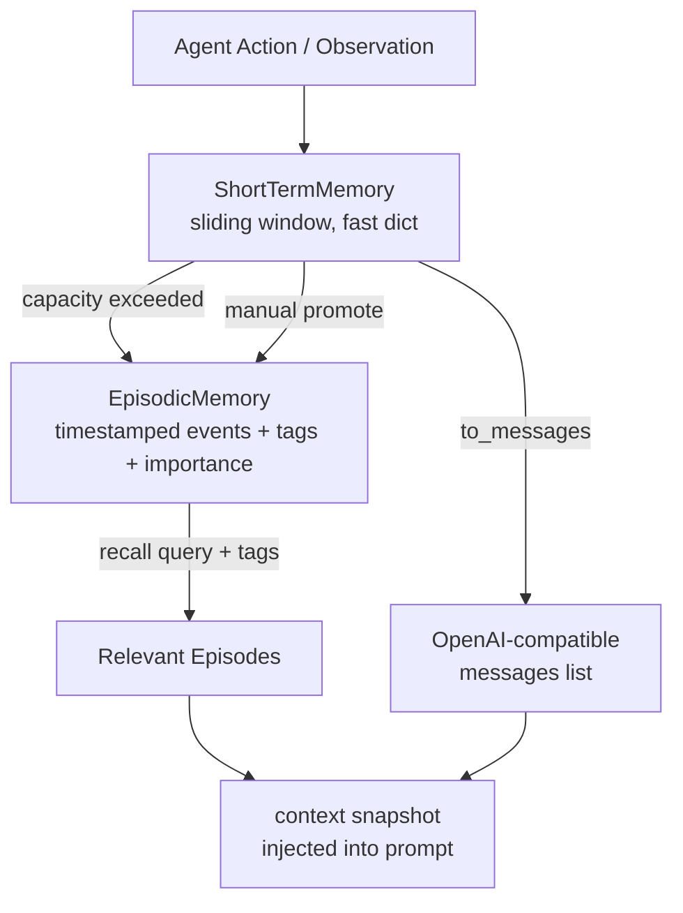
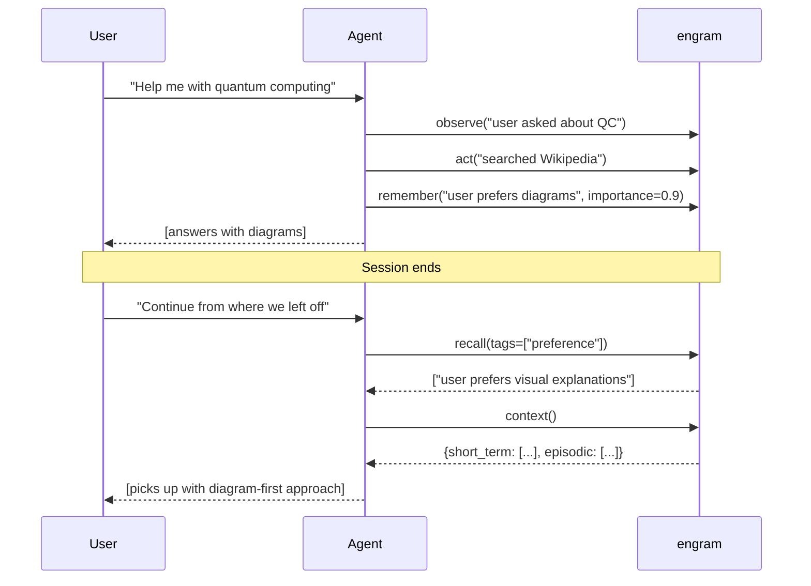

<p align="center">
  
</p>

<p align="center">
  <a href="https://github.com/darshjme/engram/actions/workflows/ci.yml"></a>
  <a href="https://pypi.org/project/agent-memory/"></a>
  <a href="https://python.org"></a>
  <a href="LICENSE"></a>
  
  
</p>

<p align="center"><b>Short-term working memory + episodic recall for agents — without a vector database.</b></p>

---

## What Is an Engram?

In neuroscience, an **engram** is the physical trace a memory leaves in the brain — the biological substrate of a specific experience. When you remember something, you're activating an engram.

Most agents have no engrams. They wake up blank every session, re-ask questions they've already answered, and forget what the user told them 10 minutes ago.

This library fixes that.

---

## Architecture



Two tiers. No vector database. No external services. No configuration.

---

## Quick Start

```bash
git clone https://github.com/darshjme/engram
cd engram && pip install -e .
```

```python
from agent_memory import AgentMemory

memory = AgentMemory(short_term_size=10)

# Session 1 — record everything
memory.observe("User asked about quantum computing")
memory.act("Called search_tool('quantum computing basics')")
memory.observe("Found: superposition, entanglement, qubits")
memory.remember(
    "User prefers visual explanations with diagrams",
    tags=["preference"],
    importance=0.9
)
```

```python
# Session 2 — full context restored
hits = memory.recall(tags=["preference"])
# → [MemoryEntry: "User prefers visual explanations..."]

ctx = memory.context()
# {
#   "short_term": [...recent observations...],
#   "episodic": [...important remembered facts...]
# }

# Inject into your LLM prompt
messages = [
    {"role": "system", "content": f"Context: {ctx}"},
    {"role": "user", "content": user_input},
]
```

---

## Memory Session Lifecycle



---

## engram vs. Vector Database

| | engram | Vector DB (Qdrant/Pinecone) |
|--|--------|---------------------------|
| **Best for** | Session state, recent context, preferences | Semantic search across 100k+ documents |
| **Latency** | Microseconds (dict lookup) | 10–100ms (network + index) |
| **Setup** | Zero — `pip install -e .` | Database server, embeddings model, indexing pipeline |
| **Persistence** | In-process (extend to add file/DB backend) | Native |
| **Token overhead** | ~200 tokens for context snapshot | ~100 tokens per retrieved chunk |

**Rule of thumb:** If your agent needs to remember what happened 5 minutes ago — use engram. If it needs to search a knowledge base — use a vector DB.

---

## API Reference

### `ShortTermMemory(max_size=10)`

| Method | Returns | Description |
|--------|---------|-------------|
| `.add(role, content, **meta)` | `MemoryEntry` | Append (evicts oldest at capacity) |
| `.get_recent(n=5)` | `list[MemoryEntry]` | N most recent entries |
| `.to_messages()` | `list[dict]` | OpenAI-style `{role, content}` list |
| `.clear()` | `None` | Wipe buffer |

### `AgentMemory(short_term_size=10)`

| Method | Description |
|--------|-------------|
| `.observe(content, **meta)` | Add observation to short-term |
| `.act(content, **meta)` | Add action to short-term |
| `.remember(content, tags, importance)` | Promote to episodic store |
| `.recall(query=None, tags=[], limit=10)` | Search episodic by tags + importance |
| `.context()` | Full snapshot dict — inject into prompt |
| `.compress(summarize_fn=None)` | Compress short-term into episodic |
| `.reset()` | Clear everything |

---

## Part of Arsenal

```
verdict · sentinel · herald · engram · arsenal
```

| Repo | Purpose |
|------|---------|
| [verdict](https://github.com/darshjme/verdict) | Score your agents |
| [sentinel](https://github.com/darshjme/sentinel) | Stop runaway agents |
| [herald](https://github.com/darshjme/herald) | Semantic task router |
| [engram](https://github.com/darshjme/engram) | ← you are here |
| [arsenal](https://github.com/darshjme/arsenal) | The full pipeline |

---

## License

MIT © [Darshankumar Joshi](https://github.com/darshjme) · Built as part of the [Arsenal](https://github.com/darshjme/arsenal) toolkit.
