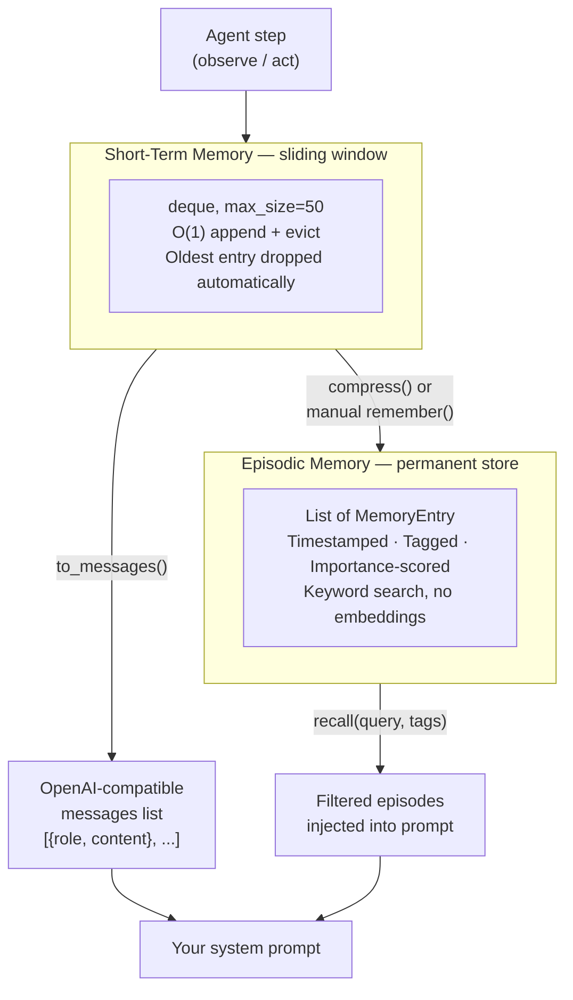

<div align="center">
  
</div>

<br/>

<div align="center">

# Agents forget. engram makes them remember.

<a href="https://github.com/darshjme/engram/actions/workflows/ci.yml"></a>
<a href="https://pypi.org/project/agent-memory/"></a>
<a href="https://python.org"></a>
<a href="LICENSE"></a>


</div>

---

## The Problem

You've built a ReAct agent. It runs a loop. On step 7, it hits a 429 rate-limit. On step 8, it hits the same 429 again — because it has no memory of step 7. On step 14, it re-discovers an API endpoint it found on step 3.

LLM agents have no memory between steps. They repeat mistakes. They lose context. They hallucinate things they already discovered. Every observation evaporates the moment the loop continues.

The standard fix is a vector database. That's a new service to run, a new embedding model to call, a new failure mode to debug, and 200ms of latency per lookup. For a short-term context window, it is engineering overkill.

engram is the other option.

---

## The Solution

Two tiers. No external services. No configuration. Drop it into any agent loop in under five minutes.

```python
from agent_memory import AgentMemory

memory = AgentMemory(short_term_size=50)

# Step 1 — agent observes the environment
memory.observe("GET /api/data → 404, endpoint not found")

# Step 2 — agent takes an action
memory.act("Switching to fallback endpoint /api/v2/data")

# Step 3 — something worth keeping forever
memory.observe("GET /api/v2/data → 200, received 143 records")
memory.remember("Fallback endpoint /api/v2/data is the live one. Primary is dead.")

# Later — build your prompt
context = memory.recall()
# Returns: recent short-term entries + relevant episodic events
# Inject into your system prompt. Done.
```

That's the entire integration surface. The agent now carries its own working memory across every step in the loop.

---

## Installation

```bash
pip install agent-memory
```

Or from source:

```bash
git clone https://github.com/darshjme/engram
cd engram && pip install -e .
```

**Zero runtime dependencies.** Standard library only (`collections`, `dataclasses`, `datetime`, `typing`). Nothing to pin. Nothing to break.

---

## Architecture

engram uses two tiers that mirror how human working memory actually operates:



**Short-term memory** is a `collections.deque` capped at `max_size` entries. When the cap is reached, the oldest entry is evicted automatically — O(1) cost, no GC pressure.

**Episodic memory** is an append-only list of events you explicitly promote. Recall is keyword-based substring matching with optional tag filtering. No embedding model. No vector index. Lookup is O(n) on episode count, which stays small by design.

---

## How an Agent Run Looks

```mermaid
sequenceDiagram
    participant Loop as Agent Loop
    participant STM as ShortTermMemory
    participant EP as EpisodicMemory
    participant LLM as LLM API

    Loop->>STM: observe("user asked for Q3 revenue report")
    Loop->>LLM: call with memory.recall() in system prompt
    LLM-->>Loop: action: "query database for Q3 data"
    Loop->>STM: act("querying: SELECT * FROM revenue WHERE quarter=3")
    Loop->>STM: observe("result: 2.4M rows, took 8.2s")
    Loop->>EP: remember("Q3 query is slow — 8.2s for 2.4M rows. Add LIMIT.")
    Loop->>LLM: next call — agent knows about the slowness
    LLM-->>Loop: action: "query with LIMIT 1000 and aggregate in Python"
    Loop->>STM: observe("result: 1000 rows, 0.3s")
    Note over STM: Oldest entries evicted as window fills
    Note over EP: "Q3 query is slow" persists across all future steps
```

The episodic entry about query slowness survives every loop iteration. The agent never has to re-discover this. That's the entire point.

---

## API Reference

### `MemoryEntry`

The unit of storage for both tiers.

```python
@dataclass
class MemoryEntry:
    role: str           # "user", "assistant", "system", or custom
    content: str        # The text of the entry
    timestamp: str      # ISO 8601, set at creation
    metadata: dict      # Arbitrary key/value pairs
```

Convert to OpenAI message format:

```python
entry.to_message()
# → {"role": "assistant", "content": "action: retry with backoff"}
```

---

### `ShortTermMemory`

A sliding window buffer of the most recent `max_size` observations and actions.

```python
from agent_memory import ShortTermMemory

stm = ShortTermMemory(max_size=50)  # default: 10
```

| Method | Signature | Returns | Notes |
|--------|-----------|---------|-------|
| `add` | `add(role, content, **metadata)` | `MemoryEntry` | Evicts oldest if at capacity |
| `get_recent` | `get_recent(n=5)` | `list[MemoryEntry]` | Last n entries, newest last |
| `to_messages` | `to_messages()` | `list[dict]` | OpenAI-compatible format |
| `clear` | `clear()` | `None` | Empties the buffer |
| `__len__` | `len(stm)` | `int` | Current entry count |

**Capacity behaviour:** When `len(stm) == max_size` and you call `add()`, the oldest entry is evicted in O(1) time via `deque(maxlen=N)`. No manual pruning required.

```python
stm = ShortTermMemory(max_size=3)
stm.add("user", "step 1")
stm.add("assistant", "step 2")
stm.add("user", "step 3")
stm.add("assistant", "step 4")  # "step 1" is now gone

len(stm)          # → 3
stm.get_recent(2) # → [step 3, step 4]
stm.to_messages() # → [{role: "assistant", content: "step 2"}, ...]
```

---

### `EpisodicMemory`

An append-only store for events worth keeping across the entire agent run.

```python
from agent_memory import EpisodicMemory

ep = EpisodicMemory()
```

| Method | Signature | Returns | Notes |
|--------|-----------|---------|-------|
| `remember` | `remember(content, tags=[], importance=0.5)` | `MemoryEntry` | Appends permanently |
| `recall` | `recall(query="", tags=[], min_importance=0.0, limit=10)` | `list[MemoryEntry]` | Keyword + tag filter |
| `all_episodes` | `all_episodes()` | `list[MemoryEntry]` | Full unsorted store |
| `clear` | `clear()` | `None` | Wipes all episodes |

**`remember(content, tags, importance)`**

- `content` — Plain text description of the event.
- `tags` — List of strings for later filtering (e.g., `["auth", "credentials"]`).
- `importance` — Float 0.0–1.0. Used as a filter threshold in `recall()`. Not used for ranking.

**`recall(query, tags, min_importance, limit)`**

Returns episodes where:
- `query` appears as a substring of `content` (case-insensitive), **and**
- All provided `tags` are present in the episode's tags, **and**
- `importance >= min_importance`

Results are the most recent `limit` matching entries.

```python
ep.remember("Primary API endpoint /v1 is deprecated", tags=["api", "endpoint"], importance=0.9)
ep.remember("Auth token expires every 3600s", tags=["auth"], importance=0.8)
ep.remember("Debug mode was briefly enabled", tags=["debug"], importance=0.2)

ep.recall(query="api")          # → [first entry]
ep.recall(tags=["auth"])        # → [second entry]
ep.recall(min_importance=0.7)   # → [first, second entries]
ep.recall(limit=1)              # → [most recent episode]
```

---

### `AgentMemory`

The primary interface. Wraps `ShortTermMemory` and `EpisodicMemory` with a unified agent-oriented API.

```python
from agent_memory import AgentMemory

memory = AgentMemory(short_term_size=50)
```

| Method | Signature | Effect |
|--------|-----------|--------|
| `observe` | `observe(content, **metadata)` | Adds to short-term with role `"user"` |
| `act` | `act(content, **metadata)` | Adds to short-term with role `"assistant"` |
| `remember` | `remember(content, tags=[], importance=0.5)` | Promotes to episodic permanently |
| `recall` | `recall(query="", tags=[], min_importance=0.0, limit=10)` | Returns matching episodes |
| `context_snapshot` | `context_snapshot(recent_n=5, query="", tags=[])` | Dict with both tiers |
| `compress` | `compress(summarize_fn=None)` | Moves oldest short-term entry → episodic |
| `reset` | `reset()` | Clears both tiers |

**`context_snapshot()`** returns a single dict you can serialize and inject into any prompt:

```python
snapshot = memory.context_snapshot(recent_n=5, query="rate limit")
# {
#   "recent": [
#     {"role": "user", "content": "GET /api → 429"},
#     {"role": "assistant", "content": "sleeping 60s"}
#   ],
#   "episodes": [
#     {"role": "system", "content": "rate limit: 100 req/min on /api", ...}
#   ]
# }
```

**`compress(summarize_fn=None)`** moves the oldest short-term entry into episodic memory, freeing capacity without losing the information entirely. Pass a `summarize_fn` to merge the entire short-term buffer into a single episodic summary instead:

```python
def my_summarizer(entries):
    # entries: list[MemoryEntry]
    return "Summary: " + " | ".join(e.content for e in entries)

memory.compress(summarize_fn=my_summarizer)
# short_term is now empty; episodic has one summary entry tagged ["summary"]
```

---

## When to Promote to Episodic

The `remember()` call is deliberate. Not everything belongs in episodic memory — only facts that remain true across many future steps, or events with consequences the agent must never repeat.

**Promote when the agent:**
- Discovers a permanent constraint (`"endpoint /v1 is dead"`)
- Completes an irreversible action (`"payment of $240 sent to vendor"`)
- Encounters a class of failure it must avoid (`"this API blocks IPs after 10 failures/min"`)
- Finds a fact that will be re-queried but is expensive to re-derive (`"user's timezone is Asia/Kolkata"`)

**Do not promote:**
- Intermediate calculations
- Transient state (`"button is currently disabled"`)
- Anything that changes on the next observation

```python
# Bad — transient, will be stale by step 10
memory.remember("Current retry count is 3")

# Good — permanent fact with consequence
memory.remember(
    "API key sk-prod-*** has a 100 req/min cap. Hitting it causes 24h ban.",
    tags=["api", "rate-limit"],
    importance=0.95
)
```

The `importance` field exists for filtering, not ranking. A 0.95-importance episode is not surfaced before a 0.5-importance one unless you explicitly filter with `min_importance`. Treat it as a severity label.

---

## Complete Example: ReAct Loop with engram

```python
from agent_memory import AgentMemory

memory = AgentMemory(short_term_size=50)

def build_system_prompt(memory: AgentMemory) -> str:
    snapshot = memory.context_snapshot(recent_n=10)
    recent = "\n".join(f"[{e['role']}] {e['content']}" for e in snapshot["recent"])
    episodes = "\n".join(f"[EPISODE] {e['content']}" for e in snapshot["episodes"])
    return f"""You are a ReAct agent. Think step-by-step.

Working memory (last 10 steps):
{recent or "Empty."}

Key facts (always true):
{episodes or "None yet."}

Now reason about the next action."""

# --- Agent loop ---
for step in range(20):
    prompt = build_system_prompt(memory)
    # response = llm.call(prompt)  # your LLM call here

    # Parse and record
    memory.observe(f"step {step}: environment state X")
    memory.act(f"step {step}: decided to do Y")

    # Promote key findings
    if step == 3:
        memory.remember("Tool A fails silently on empty input", tags=["tool-a"], importance=0.85)

    # Free short-term capacity mid-run if needed
    if len(memory.short_term) > 45:
        memory.compress()
```

---

## Philosophy

The Vedas were humanity's first memory system — oral traditions engineered to survive across generations without a single byte of written storage. The rishi knew that memory is not accumulation. It is selection: what to keep, what to let go, what to mark as permanent.

engram applies the same discipline to agents. Short-term memory holds what is immediately relevant. Episodic memory holds what must not be forgotten. The boundary between them is a deliberate decision — `remember()` — not an automatic classifier.

Most agent frameworks try to remember everything. They embed every observation, store every token, retrieve by cosine similarity. The result is agents that confidently recall irrelevant context and miss the one fact that mattered.

engram does less, deliberately. It gives you a 50-entry sliding window and an explicit promotion API. The cognitive load of deciding what matters stays with the engineer — where it belongs.

---

## What engram Is Not

engram is intentionally scoped. It does not:

- **Persist memory to disk.** All state is in-process. Restart the process, memory resets. If you need persistence, serialize `memory.short_term.to_messages()` and `memory.episodic.all_episodes()` to JSON yourself.
- **Search by embedding.** Recall is keyword substring matching. For semantic search across thousands of episodes, use a vector database. engram is for runs of 10–500 steps with dozens of episodes, not knowledge bases.
- **Summarize automatically.** The `compress()` method moves entries; summarization requires you to pass a `summarize_fn`. Your LLM call, your cost, your control.
- **Thread-share state.** `AgentMemory` is not thread-safe. One instance per agent run.

---

## Running Tests

```bash
git clone https://github.com/darshjme/engram
cd engram
pip install -e .
python -m pytest tests/ -v
```

13 tests. All passing. No mocking, no fixtures, no async machinery.

---

## Contributing

engram is intentionally minimal. Before opening a PR that adds a new feature, open an issue first. The right question is usually: *does this belong here, or does it belong in the caller?*

See [CONTRIBUTING.md](CONTRIBUTING.md) for the full process.

---

## License

MIT. See [LICENSE](LICENSE).

---

<div align="center">
  <sub>Built for agents that need to remember. By <a href="https://github.com/darshjme">darshjme</a>.</sub>
</div>
